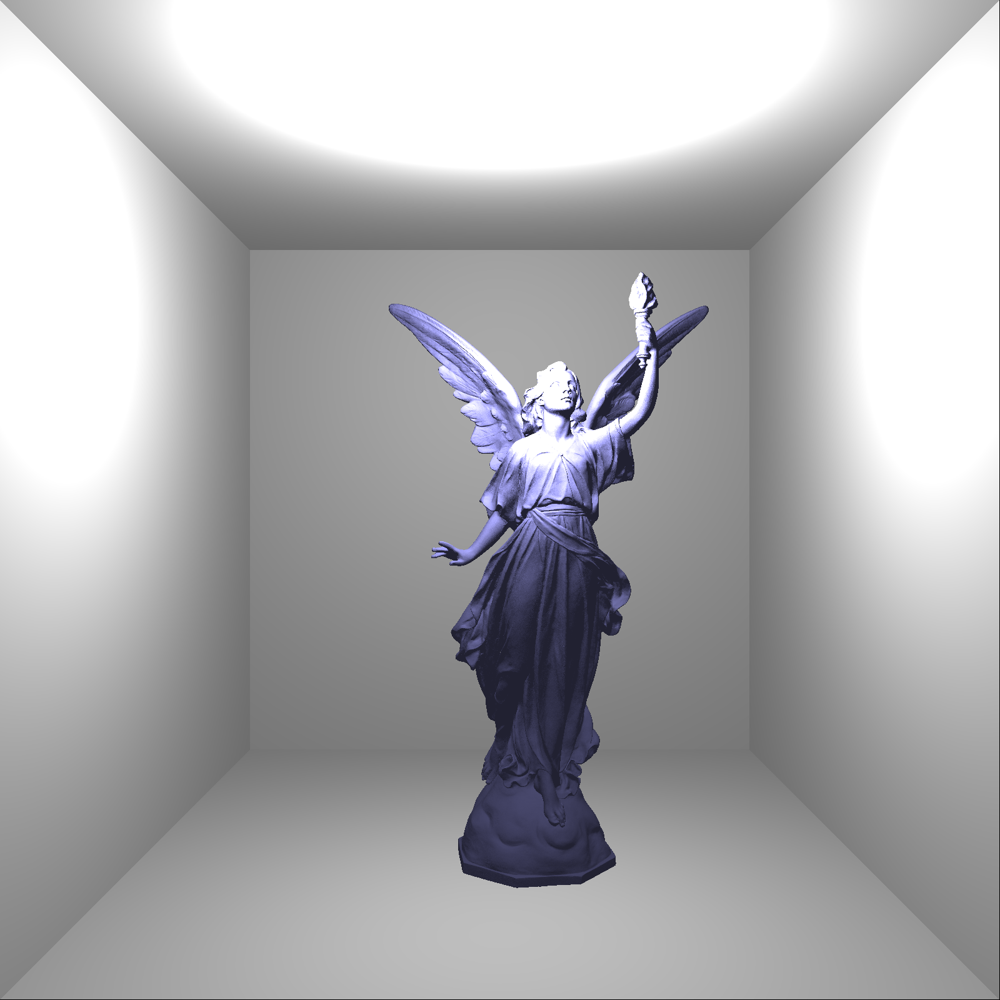

# Raytracer

<p float="left">
  
</p>
<p float="left">
  
</p>

***
### Features
- Monte Carlo Path Tracing
- Anti-aliasing and soft shadows
- Diffuse, emissive, specular, transparent and refractive materials
- Fresnel effect (using Schlick's approximation)
- Beer-Lambert law
- Fog density
- Tone mapping and gamma correction
- OpenMP parallelism

### Usage
```
Usage: ./raytracer [OPTIONS]
1.
  --once                  render 1 frame
  --realtime              render continuously
2.
  --cornell-box           load test model
  --load     <file.obj>   load custom model
  --load-box <file.obj>   load custom model, inside Cornell Box
```

### Controls
```
 Move view:             Move light:             Rotate camera:

     W                      I                         ^
  A  S  D                J  K  L                   <  v  >

  Q --> up               U --> up
  E --> down             P --> down
```

# Rasteriser

<p float="left">
  
</p>

***
### Features
- Texture mapping
- Custom model loader
- FXAA

### Usage
```
Usage: ./rasteriser [OPTIONS]
1.
  --once                  render 1 frame
  --realtime              render continuously
2.
  --cornell-box           load test model
  --load     <file.obj>   load custom model
  --load-box <file.obj>   load custom model, inside Cornell Box
```

### Controls
```
 Move view:             Move light:             Rotate camera:

     W                      I                       MOUSE  
  A  S  D                J  K  L                   

  Q --> up               U --> up
  E --> down             P --> down
```

Note: The `lucy.obj` model is not committed because its size is too big (2.45 GB)
